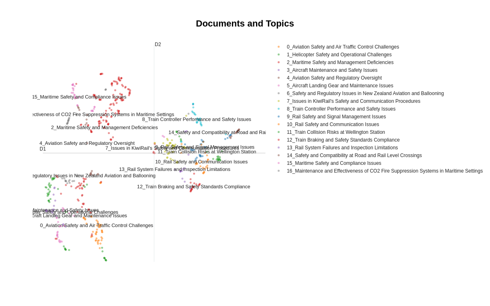

# Introduction

This project has developed and expanded its scope quite alot since it's inception. The current path it has been going down is to develop a solid pipeline that can then be implemented on other agencies reports. Currently the projects areas can be split into three categories. These are "Metadata extraction and dataset building", "Searching of dataset" and "Data mining of dataset". The first work that was completed prior to Christmas 2023 and was focussed on metadata extraction and a little work on the searching problem. Recent work has developed and hardened metadata extraction. The project is being worked on publicly on GitHub [here](https://github.com/1jamesthompson1/TAIC-report-summary)

# State

The current project takes in reports and extracts the metadata, safety issues, recommendations etc to give us a dataset. There has been some analysis of the dataset as well as a trivial implementation of searching of this dataset.

The last couple months of work has been expanding the metadata extraction and increasing its trustworthiness. This metadata extraction is substantially completed for TAIC and now work can be done making this dataset as useful as possible.

# Avenues of future work

Each one of these can be pursued more or less independently. There are many different things that could be focussed on. However these seem from my perspective provide the most utility for TAIC.

## Metadata extraction on other agencies

The work on the engine has not been exclusively specific to TAIC's reports. This means that performing the same metadata extraction on other reports will involve two things.

- Developing a new agency specific parser that will get reports ready to be processed
- Ironing out issues with the engine to make it robust enough to handle other report.

I anticipate each agency will take 3 weeks to add metadata extraction for. However later ones should become quicker as more robust tools are built.

## Developing smart search capabilities of the dataset

As the number of reports in the dataset increase the ability to search and find relevant reports will be more and more important. There are two new technologies which can be really useful here. Both of the mentioned solutions are designed to work at great scale so adding in extra reports from other agencies is a trivial problem.
Firstly a vector database, these allow for really fast semantic searching of reports (i.e "Boats that sunk due to fire" could return top 5 most relevant reports). (2 weeks for a prototype)
Secondly is a Retrieval Augmentation Generation system which allows you to converse with your dataset. This works by having a LLM (similar to ChatGPT) be your interface and it interacts with the vector database directly. (2 weeks for a prototype built on top of the vector database)

## Data mining the datasets

There are many different sort of analysis that can be done on the extracted datasets. The first and most useful is searching and finding but it can also be used to run analysis on. The process of Data mining is looking through datasets and trying to discover useful analysis that can be done. Spending time doing the data mining would come up with lots of interesting insights and it will only expand as the dataset expands. However for now I will give a few concrete examples that can be conducted. Both of these ideas are inspired by an [Australian's research into Rail Accident report safety hazards and recommendations](https://australasiantransportresearchforum.org.au/wp-content/uploads/2023/12/ATRF_2023_Paper_19.pdf)

### Generation of Safety themes from Safety issues

A little bit of work has been conducted to try and generate safety themes from safety issues. This involves using the topic model [BERTopic](https://maartengr.github.io/BERTopic/index.html) and produces themes from all of the safety issues. This is yet to be completed but does pose an interesting replacement/supplement of TAIC's watchlist.

{ width=650px }

### Modelling recommendations

There are a few things that can be done. Firstly similar to what was done with the safety themes you could generate recommendation themes. Alternatively you could perform a different sort of topic model to help determine what level of the system is being targeted (oversight, single business etc). These experiments would take 3-4 weeks to fully investigate. However it would be best completed once other agencies metadata have been extracted.

# Conclusion

