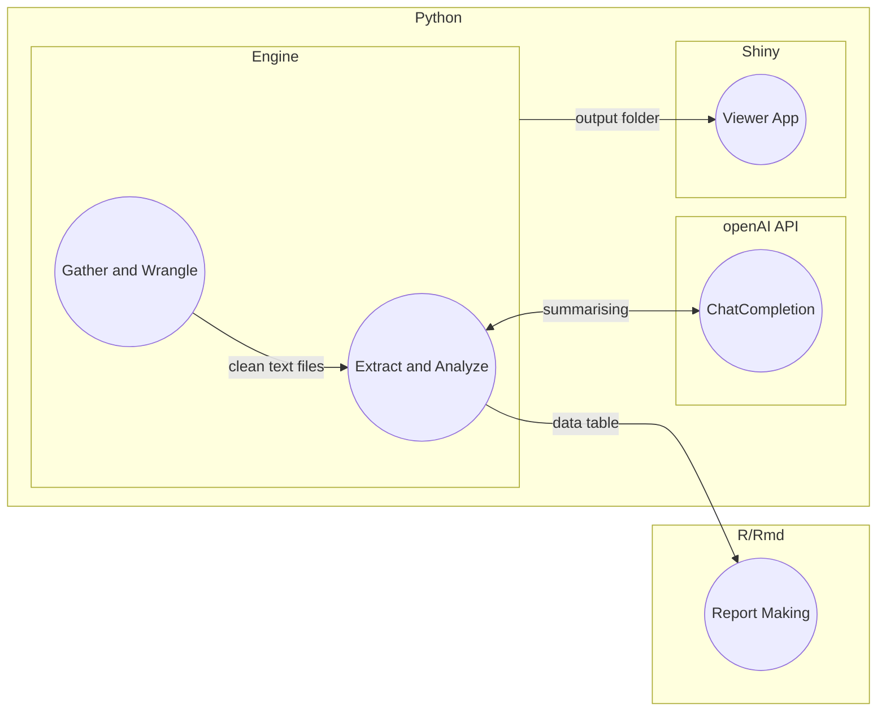

# TAIC-report-summary

## What

This is a Meta Analysis project to look at the marine investigation reports made by the Transport accident investigation commission ([TAIC](https://www.taic.org.nz/)) in New Zealand.
There will be only use of publicly available data and the reports will be summarised using a variety of techniques. The reports that will be looked can be found on there [website](https://www.taic.org.nz/inquiries?order=field_publication_date_value&sort=desc&keyword=&date_filter%5Bmin%5D%5Bdate%5D=&date_filter%5Bmax%5D%5Bdate%5D=&publication_date%5Bmin%5D%5Bdate%5D=&publication_date%5Bmax%5D%5Bdate%5D=&status%5B0%5D=12).

This project is being completed as my final year Computer Science project for my BSc at Massey University.
There will be additional documents that will be submitted to Massey University as part of the project. All of these documents will be found in the [Uni Project document folder](/Uni%20project%20documents/).

## Goal

To be able to make meaningful connections between all the reports.

Currently the MVP is three fold:

- Engine that can read the reports and provide a summary of the Analysis and Findings sections. See [engine module](https://github.com/1jamesthompson1/TAIC-report-summary/tree/main/engine)
- Viewer app that can help a user navigate and interpret the results from the engine. See [viewer app](https://github.com/1jamesthompson1/TAIC-report-summary/tree/main/viewer)
- A 2 page report that can put togather all the findings that can be found from the output of the engine.

## How

All of the projects code will be done in python. The main engine will be written in python with use of the openAI api and the viewer app is built with Shiny for python ([#17](https://github.com/1jamesthompson1/TAIC-report-summary/issues/17)).

### Architecture



### openAI API

Currently to do all the fancy "ai" stuff I am using ChatCompletion meaning that I simply provide instructions and a prompt to a pre trained model. This causes some context issues as I am stuck with gpt 3.5 for now. (See [#7](https://github.com/1jamesthompson1/TAIC-report-summary/issues/7) and [#8](https://github.com/1jamesthompson1/TAIC-report-summary/issues/8))

# Contributing / Using

Depending on your level of experience and how setup your computer is you will either have to start at [Setting up your environment](#setting-up-your-environment) or [Setting up project](#setting-up-project).

See [Using project](#using-project) for how to use the project and run the engine or viewer app.

## Setting up your environment

This will help anyone setup and use this repo from scratch. This is a guide for Windows only (Tested on 11 but may work on 10).
It is so that a complete lay person can get started and see this project working.

If you know what you are doing you can skip to [Setting up project](#setting-up-project)

All of this will be done from powershell so you can open it by pressing the windows key and typing "powershell" then clicking on Windows Powershell.


**This is all assumed to be done on Windows**

### Need to do
- [Setup scoop](#setup-scoop)
- [Setup Git](#setup-git)
- [Setup Python](#setup-python)
- Get IDE (Would recomend [vscode](#setup-vscode))

### Setup scoop

Scoop is used to help manage your apps and software on your computer.

Installing scoop is easy, just copy and paste this into powershell:
```
Set-ExecutionPolicy RemoteSigned -Scope CurrentUser
irm get.scoop.sh | iex
```

### Setup Git

Git is a version control system. It is the defacto standard in the industry and is used to manage code and projects.

#### Install Git

```
scoop install git
```

#### Setting up git

You need to give Git your name and a email address:

Set your name with:
```
git config --global user.name "firstname lastname"
```

And email address with:
```
git config --global user.email "YOUR_EMAIL"
```

#### Pulling the repo

Make sure you are in your "home" direcoty with this command

```
cd ~
```

Lastly you need to clone the repo this will bring all the files here onto your computer:
```
git clone https://github.com/1jamesthompson1/TAIC-report-summary.git
```

### Setup Python

Python is one of the programming languages used here to do the main work.

#### Install Python

```
scoop install python
```

#### Install pip

```
scoop install pip
```

### Install poetry (Package and Dependency manager)

More instructions can be found here: https://python-poetry.org/docs/

But all you need to do is run
```
(Invoke-WebRequest -Uri https://install.python-poetry.org -UseBasicParsing).Content | py -
```

### Setup VSCODE

VScode is a IDE (Integrated Development Environment) that is used to write code and run it.

#### Install VSCODE

```
scoop install vscode
```

#### Install Python extension

Open vscode and press `ctrl+shift+x` and search for `python` and install the first one.

## Setting up project

To set the project up you will need to download some python packages and setup your openAI api.

### poetry setup

This project uses poetry to help manage the project. Just make sure you are in the project directory then run this command:

```
poetry install
```


#### Setup openAI
For this project to work you need to have an openAI key.

#### Getting your key

Instructions can be found here about how to get an api key: https://www.howtogeek.com/885918/how-to-get-an-openai-api-key/

Simply put create an openAI account go to your account and create a new key

#### Putting your key in the project

Now that you have your key you will need to create a file called .env in the root directoy of the project.
It needs only one with your api key in it. This means the file would look something like this

> OPENAI_API_KEY=sk-xWHey2gE3BLskFJzx33cDzRbdR66hDxAhum5voMmETL8yZwy

It is important however to keep this key free. As using the api costs money so if someone else got ahold of your key then they could use it and you would be charged.

## Using project

There are two distinct parts to this project and so running them are distnct operations.

Both of them however run using poetry scripts. So it will look something like `poetry run <script name>`

There is also a configuration file that can be found in 'config.yaml'

### Configuration

This file is used to configure both the engine and the viewer. It helps them be on the same page. 

There are currently three sections. 

#### download

This is where you control what the engine will download.

There are three things you might want to change.

- The year range. This can be changed by simply updating the start and ending range.
- How many reports per year. This is the count of how many reports to download per year per mode.
- The modes you want to analyse. There are three support modes, 'a' for aviation, 'r' for rail and 'm' for marine. It is important that when adding or removing modes that you keep the correct list syntax as seen.

#### output

This is just instructions on the format of the output and should not needed to be changed

#### validation

This is also just instructions on the format of the validation and should not need to be changed.

### engine

A complete run through can be done by running the following command:
```
poetry run engine -t all
```

The engine is split into multiple sections. For  information about these steps please run `poetry run engine --help`. 

Then if you want to run a specific section or do the cost calculation then you have to run the command with the correct arguments. For example to run the summarization cost calculation you would run:
```
poetry run engine -t summary -c
```

Note that in the cli you can only tell the engine what to do not how to do it. All the configuration can be found in the [config file](#configuration).

### viewer

The viewer is a bit different. In the future I would expect the web app to be hosted somewhere but while we are in development it will be run locally.

To run the viewer app you need to run the following command:
```
poetry run viewer
```

This will then open on a local server and you can view the app in your browser. You will need to visit your terminal (Ctrl + ` in vscode) and copy the url into your browser. IT will look something like this:
> (taic-report-engine-py3.11) PS C:\Users\James\code\TAIC-report-summary> poetry run viewer
INFO:     Will watch for changes in these directories: ['C:\\Users\\James\\code\\TAIC-report-summary\\viewer']
INFO:     Uvicorn running on http://127.0.0.1:8000 (Press CTRL+C to quit)
INFO:     Started reloader process [5696] using WatchFiles
INFO:     Started server process [21020]
INFO:     Waiting for application startup.
INFO:     Application startup complete.

So you will need to either click on or copy the url into your browser. In this case it would be http://127.0.0.1:8000