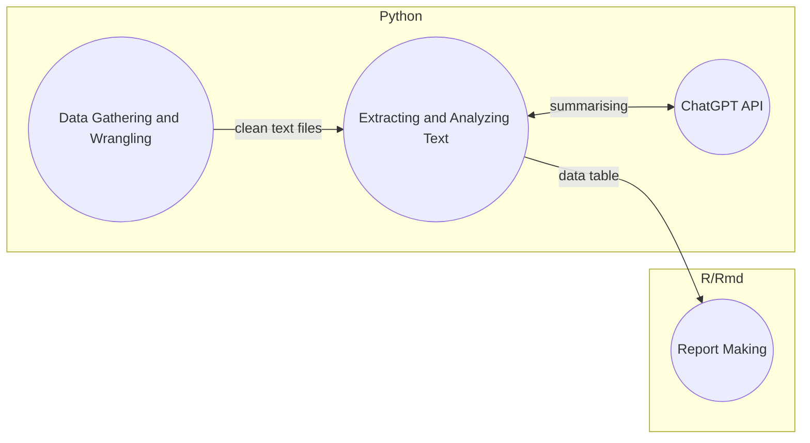

# TAIC-report-summary

## What

This is a Meta Analysis project to look at the marine investigation reports made by the Transport accident investigation commission ([TAIC](https://www.taic.org.nz/)) in New Zealand.
There will be only use of publicly available data and the reports will be summarised using a variety of techniques. The reports that will be looked can be found on there [website](https://www.taic.org.nz/inquiries?order=field_publication_date_value&sort=desc&keyword=&date_filter%5Bmin%5D%5Bdate%5D=&date_filter%5Bmax%5D%5Bdate%5D=&publication_date%5Bmin%5D%5Bdate%5D=&publication_date%5Bmax%5D%5Bdate%5D=&status%5B0%5D=12).

This project is being completed as my final year Computer Science project for my BSc at Massey University.
There will be additional documents that will be submitted to Massey University as part of the project. All of these documents will be found in the [Uni Project document folder](/Uni%20project%20documents/).

## Goal

To be able to make meaningful connections between all the reports.

Currently the MVP is a few page report showing what insights can be found in about 40 hours of work.

## How

Heavy lifting of data wrangling will be done with python. The extraction or insights will be done using ChatGPT api and then final report making can be done with Rmarkdown.

### Architecture
The hope is that it will look something like this in the end.


# Contributing

## Setting up your environment

This will help anyone setup and use this repo from scratch. This is a guide for Windows only (Tested on 11 but may work on 10).
It is so that a complete lay person can get started and see this project working.

If you konw what you are doing you can skip to [Setting up project](#setting-up-project)

All of this will be done from powershell so you can open it by pressing the windows key and typing "powershell" then clicking on Windows Powershell.


**This is all assumed to be done on Windows**

### Need to do
- [Setup scoop](#setup-scoop)
- [Setup Git](#setup-git)
- [Setup Python](#setup-python)
- Get IDE (Would recomend [vscode](#setup-vscode))

### Setup scoop

Scoop is used to help manage your apps and software on your computer.

Installing scoop is easy, just copy and paste this into powershell:
```
Set-ExecutionPolicy RemoteSigned -Scope CurrentUser
irm get.scoop.sh | iex
```

### Setup Git

Git is a version control system. It is the defacto standard in the industry and is used to manage code and projects.

#### Install Git

```
scoop install git
```

#### Setting up git

You need to give Git your name and a email address:

Set your name with:
```
git config --global user.name "firstname lastname"
```

And email address with:
```
git config --global user.email "YOUR_EMAIL"
```

#### Pulling the repo

Make sure you are in your "home" direcoty with this command

```
cd ~
```

Lastly you need to clone the repo this will bring all the files here onto your computer:
```
git clone https://github.com/1jamesthompson1/TAIC-report-summary.git
```

### Setup Python

Python is one of the programming languages used here to do the main work.

#### Install Python

```
scoop install python
```

#### Install pip

```
scoop install pip
```

### Install poetry (Package and Dependency manager)

More instructions can be found here: https://python-poetry.org/docs/

But all you need to do is run
```
(Invoke-WebRequest -Uri https://install.python-poetry.org -UseBasicParsing).Content | py -
```

### Setup VSCODE

VScode is a IDE (Integrated Development Environment) that is used to write code and run it.

#### Install VSCODE

```
scoop install vscode
```

#### Install Python extension

Open vscode and press `ctrl+shift+x` and search for `python` and install the first one.

## Setting up project

To set the project up you will need to download some python packages and setup your openAI api.

### poetry setup

This project uses poetry to help manage the project. Just make sure you are in the project directory then run this command:

```
poetry install
```


#### Setup openAI
For this project to work you need to have an openAI key.

#### Getting your key

Instructions can be found here about how to get an api key: https://www.howtogeek.com/885918/how-to-get-an-openai-api-key/

Simply put create an openAI account go to your account and create a new key

#### Putting your key in the project

Now that you have your key you will need to create a file called .env in the root directoy of the project.
It needs only one with your api key in it. This means the file would look something like this

> OPENAI_API_KEY=sk-xWHey2gE3BLskFJzx33cDzRbdR66hDxAhum5voMmETL8yZwy

It is important however to keep this key free. As using the api costs money so if someone else got ahold of your key then they could use it and you would be charged.