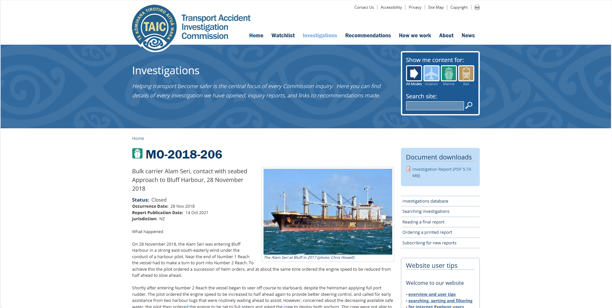
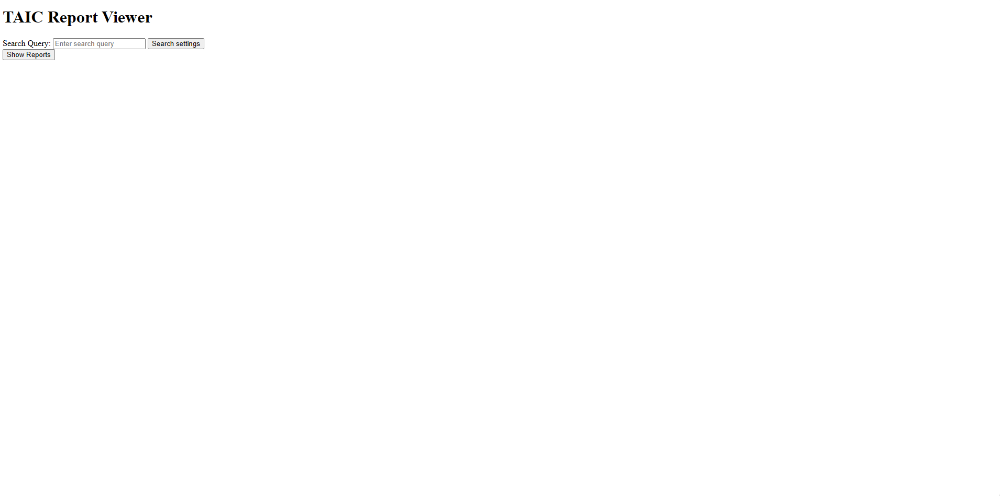
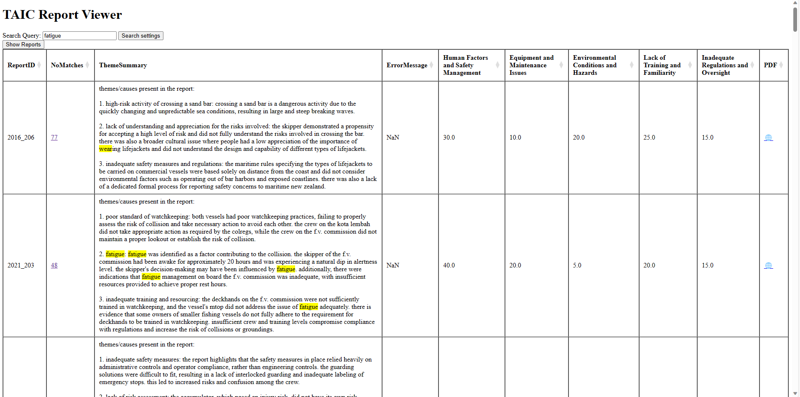
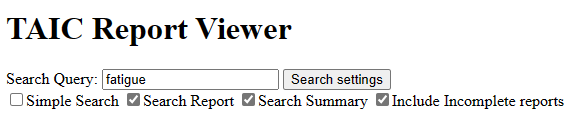
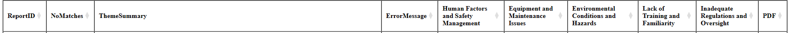
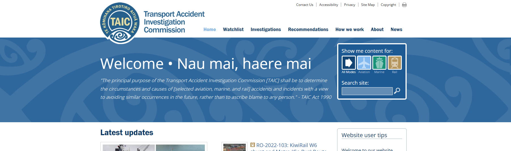

<!--
You need to run these two lines in cli to render this document.

cd C:\Users\James\OneDrive\Documents\Notes\Massey Uni BsC\2023 (third year)\Semester 2\159333\Final Report
pandoc --citeproc --bibliography 159333_Final_report.bib --csl=apa.csl -F mermaid-filter.cmd -o 21011195_159333_Final_Report.pdf -s 21011195_159333_Final_Report.md
-->
# Introduction

As this is my last project I will do for my Bachelor's Degree I wanted to do something hard, novel and interesting. It was these ideas that lead me to do this project. 

The Transport Accident Investigation Commission (TAIC) is a Crown funded organisation who's sole purpose is to do "blame free" investigations into transport accidents across Marine, Rail and Aviation. TAIC conducts about 15 transport accident investigation a year at a cost of about $450,000 each [@transportaccidentinvestigationcommisionAnnualReport2020212022]. All of these report are publicly available online [@transportaccidentinvestigationcommisionInvestigationsTAIC]. This mass of information and knowledge is supposed to help prevent the same sort of accident from happening again [@TransportAccidentInvestigation1990]. The process of taking insight form the accidents and giving it to the industry is something crucial to TAIC's purpose. It is something they have identified and are invested and in the process of upgrading their Knowledge Transfer System (KTS).

I identified that this was somewhere that AI could play a big role. My idea involved using LLMs "agents" to read the reports and help summarize them in a way to make the insights and learning not only more accessible but also comparable. Given research in the area it seemed plausible that LLMs could reason effectively in this circumstance [@espejelGPT3GPT4BARD2023] The goal is not just to summarize a single report but help understand the trends and insights that can only be found from all of that publication combined. This task involves reading all of the reports which given a human will take at least 30 minutes to read a single report is not feasible for them to read all the reports.

There was quite a simple mission for the project "The goal is to create a proof of concept that can be used to jump start further work in this area" [@jamesthompsonTAICReportSummarizer2023]. Turned into more practical features it was to have an engine that uses gpt 3.5 to summarize and extract the theme present in each accident report. This has been achieved by having an engine read each report and extracting the themes present in the accident. It then collates these individual themes and creates the global themes. Lastly its goes through all of the reports again and assigns weightings for each of the global themes. This engine has been made and validated to be at least somewhat accurate.

To make this proof of concept easier to interact with a web app viewer of the output was necessary [@jamesthompsonApplicationExampleSearch2023]. Although not part of the original plan this was added half way through and implemented to some usable state.

Even though the goals have been met the final project is still not complete. By very nature of the project it was never going to be completed in this time frame. However an effective proof of concept can be found at the GitHub repository [@thompsonTAICreportsummary2023]. 

**Disclaimer**

This project was started without the direct knowledge of TAIC. They are aware of its development and are interested by it. But this project is in no way Endorsed by TAIC. Furthermore some financial support was provided by the primary stakeholder (Rob Thompson) to help support the development of the project.

# What I did

## Plan (What I wanted to do)

Given the scope of my idea I had to narrow it down quite a lot to make it feasible for a single semester project. I laid out my initial plan in my project proposal [@jamesthompsonTAICReportSummarizer2023]. The project more or less stayed within the same intent of the proposals. As work begun more items were added to the "todo list". These were:  

- A web app that would allow a user to easily view and search the output from the engine [@jamesthompsonApplicationExampleSearch2023].  
This was added to allow the project to have a obvious application value and allow effective demonstration to non technical people.

- Validation [@jamesthompsonCreateValidationChecker2023].
Any output of the engine needed to be verified as reasonable. It was out of the scope of the project to create a sophisticated bench mark. Regardless having a validation set and comparer that could at least provide evidence that it is making reasonable interpretation was important.

- Auto generation of the global themes [@jamesthompsonAutoGenerateThemes2023]
Very early on it was noted that creating the perfect global themes was too delicate and would make the output of the engine very dependent on the specifics of the themes given to it. Instead having the engine first generate the global themes allowed the output to be as free to "fit" the data as possible.

There however were a few things that never happened and was cut from the final project:  

- Adding in more variable extraction from the reports in the breadth phase. This was removed due to time constraints and other additions were going to be more useful.  
- No time was spent looking at training/fine-tuning our own model. 
Two things were affecting this. Firstly the lack of time, with this being a stretch goal it was the first to be cut. Second was resource concerns, as fine-tuning one of the models could make API costs too high [@andrewpengGPT3TurboFinetuning].
- The final two example reports
The goal of the example reports was to give the Stakeholder a simple concise document to give out which would demonstrate the power of the engine. However it was decided that these reports would only given out once the model was in the best possible state.

## Execution (How I did it)

### Tools

#### Engine

As I working on a prototype I wanted to use a language and framework with minimal overhead to allow me to get some up and running as quickly as possible. Luckily as the engine was just going  to be making API calls the program would not need to be high performance. As the openAI api only have an official package for JS and Python [@openaiOpenAIPlatform] it made sense to start the search there. Cpp and Rust were considered briefly but feel too heavy for this style of program. I choose Python due to its ease of use, scalability and industry de facto standard status. As work began I was thankful of my choice in my language due to pythons rich eco system of packages. This relates to one of my [lessons](#eco-systems-are-important). 

Here is a complete list of the dependencies for the engine:

- openai = "^0.27.8"
- python-dotenv = "^1.0.0"
- bs4 = "^0.0.1"
- pypdf = "^3.15.0"
- requests = "^2.31.0"
- tiktoken = "^0.4.0"
- pyyaml = "^6.0.1"
- argparse = "^1.4.0"
- pandas = "^2.0.3"
- regex = "^2023.8.8"

#### Viewer

When the requirement of a web app was added [@jamesthompsonApplicationExampleSearch2023] I needed to decide on what tooling to use for it. As I had experience with R and Rmd, I was interested in using Shiny [@theshinydevelopmentteamShinyPython2023]. I started using this locally however I realised quite quickly that working within Shiny's framework was too restrictive. There was nothing wrong with Shiny however I just wanted more freedom and something simpler. Rather than find a hacky solution I looked elsewhere. I came up with flask [@arminronacherFlask2023]. This was minimal enough yet flexible so that I could add the custom things I wanted. To deploy the app I used Heroku [@Heroku] as it was the simplest to use.

#### Dev tools
As I was dealing with many packages I wanted to make it as portable as possible so I used Poetry [@PoetryPythonPackaging2023] as my dependency manger. This is because from my experience in Rust and using Crate [@rust-langCargo2023] I wanted to have a more powerful project manager than pip [@developersPipPyPARecommended]. Lastly I used R [@rcoreteamLanguageEnvironmentStatistical2023] and Rmd [@allaireRmarkdownDynamicDocuments2023] for the example reports. However as mentioned earlier only the first example report was made.

Lastly I used vscode [@VisualStudioCode2023]as my IDE with git [@linustorvaldsGitFastScalable2023] and GitHub [@GitHub] for source control.

### Components

Before talking about the components it will be best to visualize the structure of the project as it is.

~~~mermaid
graph LR
subgraph Python
	subgraph Engine
		A[Gather and Wrangle]
		B[Extract and Analyze]
		F[Verify]
	end

	subgraph openAI API
		D[ChatCompletion]
	end

	subgraph Viewer
		E[Flask web app]
	end
end

subgraph Output Folder
	H[Reports]
	I[Themes and Weightings]
end

G[Validation set]

subgraph R/Rmd
	C[Report Making]
end

B -->|prompts| D -->|responses| B
A -->|Report PDFs and Text extraction| H
B -->|Weightings and theme summaries| I
H --> B
I --> F
H --> E
I --> E
I --> C
G --> |validation| F
F -->|prompts| D -->|responses| F
~~~
*Note that this is not a dependency graph, it is just trying to explain the strucutre of the project and flow*

As can be seen there is the engine which is split into three parts. The first two `Gather_Wrangle` and `Extract_Analyze` make up the pipeline which produces the output. `Verify` is simply the validation module which is to be run after the fact. Other than that there is the `Viewer` app package which is what the web app is found in.

#### Engine

The engine is what this project is about. As seen in the graph above I have separated it out into three distinct folders. This was to help keep the ideas separate. Not shown in the graph is that there is alot of sharing of modules that do general functions. Refactoring might make hese  packages better structured. However for now all of the modules interact with each other, with `Gather_Wrangle` and `Verify` pulling modules from `Extract_Analyze` to help work with the output folders.

When ran the Engine works like a CLI program. It is run from CLI and outputs runtime logs to console and output to the output folder. There are four functions that the CLI can do. These are download, themes, summarize and verify. The first 3 of these run in chronological order and together complete the main engine "function". Which is getting all the PDF reports from the website and then analysing and summarising them.

Furthermore this project has a lot of scaffolding which is explained fully here. However the core functions of this project is to be found in the [Gather_Wrangle](#gather-and-wrangle) and [Extract_Analyze](#extract-and-analyze) modules

##### Gather and Wrangle

The main goal of this section is to simply download all the reports from [@transportaccidentinvestigationcommisionInvestigationsTAIC] and prepare them into text reports. This required two distinct steps. Downloading and PDF text extraction. 

We can think of this as the nozzle for the input to the engine. Meaning that if I wanted to expand it to other agencies or modes (Rail, aviation) I would simply have to upgrade or swap in another nozzle. To make the entire pipeline work I would need to upgrade the `extract_important_text` function in the `Extract_Analyze` module so that it could handle different report structures.

###### Downloading
As there is no API available on the TAIC website I needed to use more traditional web scraping techniques. Due to it being such a common task in python there is a library called bs4 [@richardsonBeautifulsoup4ScreenscrapingLibrary]. This means that I could use `requests` package to get the webpage and bs4 to help me find the PDF link to the report.

Getting to the right webpage was simple enough as the website follows a URL pattern. That is `https://www.taic.org.nz/inquiry/mo-{year}-{number}`. Where year is the 4 digit representation and number starts with a 2 and can go up to 299. The 2 is to say that it is marine and rest of the number is just the order in which the reports were published. Put together as year_number creates what is referred to later on as the report_id.

The reports webpage always looks about the same, see example below.

The link to the Investigation report is named almost always the same. However the link to the actual PDF follows no structure or pattern that I have found. This is where I use the `bs4` module to parse the webpage html and just extract all the pdf links. Being general enough it works every time on all the report webpages that I have encountered.

###### PDF text extraction

A PDF file is something that can be unreasonably complicated to extract the text from. This is due to a few reasons. As described in this article [@stavrakisExtractingTextPDF2023] PDFs can be separated into three categories, Programmatically generated, Image, and OCR images. Luckily we are dealing with first type which is "which are all searchable and easy to edit". Due to this and pyPDF [@fenniakPypdfPurepythonPDF] I could extract the text without worrying about optical character recognition.

My first attempts at the text extraction complicated. In retrospect I was making heavy whether of this problem. Regardless the final version is just a textbook pdf text extraction. I do however format the page number to make them easier to find further down the pipeline.

##### Extract and Analyze

This is where much of the work and time has been spent. The brains of the engine are found in this section. As there are a few modules in this section I wont be providing a break down of all of them just the two important ones. These are `Summarizer` and `ThemeGenerator`, Which perform three important functions, extracting important text, theme generation and weightings.

###### ReportExtractor  

**What**

The theme generation and weightings all need access to the report text. However due to he context limit it is not feasible to always just put the entire report in the prompt. Instead I use what I call the *important text*. This is currently defined as the Analysis and Finding sections of the reports. As the structure of the reports are the same all of them have these two sections. With the Analysis section normally being the largest section.

Also as mentioned above it would have to be this section along with `Wrangle_Analyze` that would need updating and changing to allow support for different agencies reports.

**How**

To extract the *important text* a two things need to happen.

Firstly define what *important text* is, which has been done above. Little time has been put into to testing out what including more sections would do to the output of the the engine.

Secondly extract the important text from the report. As the `Gather_Wrangle` module has already done this we luckily start in a good position. To find these sections I use regex. It was noted that each of the content sections start in the same way and thus matching can be done like this.

> `((Content)|(content)|(Contents)|(contents))([ \w]{0,30}.+)([\n\w\d\sāēīōūĀĒĪŌŪ]*)(.*\.{5,})`

Now finding the end of the content section is done by looking for the last long string of period characters ending in a number.

> `(?<!<< Page \d+ >>[,/.\w\s]*)[\.]{2,} {1,2}[\d]{1,2}`

Now that the content section is found gpt 3.5 is used to read the content section and return the sections that are wanted. I only need the start of Analysis and end of Findings because these sections are always consecutive.

> What page does the analysis start on. What page does the findings finish on? Your response is only a list of integers. No words are allowed in your response. e.g '12,45' or '10,23'. If you cant find the analysis and findings section just return 'None'

Given the page numbers it is a simple regex matching exercise to find the actual page text. As the parsing step of the pdfs added some formatting to the page numbers it is easy to extract the right pages.

**Challenges**

As it is an LLM the response wont always be perfect. Therefore two things can happen with the response. Firstly it could respond with more than just the numbers. If it does this than there is no way for me to easily parse it into numerical type which is needed. By simply asking the model to try again  we can guarantee that it eventually gets it correct. Secondly is variation in the pages it returns. This can be fixed by getting multiple responses from gpt 3.5 and taking the average. Because it is a set the average can be thought of as "items that appear most of the time". Therefore only pages that are in 3 out of the 5 responses are kept.

With these changes made the extractor consistently returns the right answer. As seen later with the validation it is the only part that appears to work 100% the same as a human. Which is not surprising as it is the simplest task.

###### ThemeGenerator  

**What**

This module does as it says on the packet it generates themes that it finds in the collection of reports. Theme generation was not originally part of the engines feature set. However generating everything from the reports directly means that the output of the engine is completely clean of *a priori* biases. Atleast the biases directly from the users generated themes.

The output of the `ThemeGenerator` are themes for individual reports and global themes that are extract from all the individual report themes.

Here is an example of what the global themes might look like after a run through.

>themes:
>
>  - title: Human Factors and Safety Management
>
>    description: "This theme encompasses various human factors and safety management issues that contributed to the accidents. These include lack of awareness, distraction, inadequate training, poor communication, and non-compliance with procedures. The theme underscores the importance of addressing human error and behavior, enhancing safety culture and leadership, and implementing effective risk management practices."
>
>
>  
>
>  - title: Equipment and Maintenance Issues
>
>    description: "This theme focuses on the equipment and maintenance issues that played a role in the accidents. These include mechanical failures, inadequate maintenance practices, and deficiencies in equipment design. The theme emphasizes the need for proper equipment inspection, maintenance, and adherence to manufacturer's specifications to prevent failures and ensure safe operations."
>
>  
>
>  - title: Environmental Conditions and Hazards
>
>    description: "This theme highlights the impact of environmental conditions and hazards on the accidents. These include adverse weather conditions, challenging navigational environments, and the presence of hazards such as sand bars and rocks. The theme emphasizes the need for proper risk assessment, planning, and adherence to safety guidelines when operating in challenging environments."
>
>  
>
>  - title: Lack of Training and Familiarity
>
>    description: "This theme focuses on the lack of training and familiarity with procedures and equipment that contributed to the accidents. These include insufficient training on safety procedures, inadequate familiarization with equipment, and lack of understanding of risks and hazards. The theme highlights the importance of comprehensive training programs and ongoing education to ensure crew members are equipped with the necessary skills and knowledge for safe operations."
>
>  
>
>  - title: Inadequate Regulations and Oversight
>
>    description: "This theme addresses the inadequacies in regulations and oversight that contributed to the accidents. These include lack of clear regulations, inconsistencies in safety standards, and insufficient oversight of compliance. The theme emphasizes the need for robust regulations, standardized safety standards, and effective oversight to ensure the safety of marine operations."

*Note that there is still some variation in the output from the engine so this shouldn't be treated as the 'final' output.*

**How**

The end goal is to have a list of 3- 6 themes with names and descriptions of each theme [@jamesthompsonAutoGenerateThemes2023]. These themes should be inclusive of all the general undertones present in the reports. This is what can be seen above.

This number of 3-6 themes is completely arbitrary. It has been decided upon as it would be most convenient to have that many final themes as that is how many as a person can easily understand. Further testing would be required to see if changing the individual and global ranges makes a positive or negative difference.

Ideally we could just take all the reports and feed them at GPT and it responds back with the general themes believes are present. However this is not possible because of the context limit in the gpt 3.5 and 4.0. Each report has about 6.5 thousand tokens. This means that to read all the reports at the same time would take about 330,000 tokens. With the current context limits being 16 thousand and 8 thousand respectively [@openaiPricing] it is not possible to do it this way. Instead we are going to need break it down and do it report by report.

It is worth noting that the larger the prompt is the more "thinking time" the model gets so it is likely to have a better answer [@karpinskaLargeLanguageModels2023] and [@openaiOpenAIPlatform].

The first step is getting the theme extracted from the report. This is done by using this prompt and gpt 3.5.

>I am trying to find the themes present across a collection of about 50 marine accident investigation reports.  For this, I need your help by reading this report and telling me the 3-6 themes/causes that are present in the report.  Your response should have a short paragraph (<= 30 words) for each theme/cause. With an empty line in between each paragraph.  Note that I want the output of this process to be consistent and repeatable. This means that I want your response to be as deterministic as possible.

Now each report will have its own themes. These themes can be collated together and sent back to gpt 3.5 with this prompt:

>I am trying to find the themes present across a collection of about 50 marine accident investigation reports.  I will give you 3-6 themes/causes summaries for each report.   Please read all of the summaries and provide 5-10 themes/causes that best cover all of the individual themes present.  Your output should have a title and description paragraph (<= 50 words) for each general theme/cause discovered.  Note that I want the output of this process to be consistent and repeatable. This means that I want your response to be as deterministic as possible.

This gives me the final output of 3-6 global themes. They look reasonable but there still is no guarantee that they encompass and include all possible themes.

**Challenges**

Because we are dealing with LLMs non determinism is of great concern. A few techniques have been employed to try help the process to actually come up with consistent results.  Below is a graph to show what it looks likes:

~~~mermaid
graph TB

report1 -->|gpt3.5 individual summarising| report1_theme_summary
report2 -->|gpt3.5 individual summarising| report2_theme_summary
report... -->|gpt3.5 individual summarising| report..._theme_summary
reportN -->|gpt3.5 individual summarising| reportN_theme_summary

report1_theme_summary --> collection[All individual reports themes]
report2_theme_summary --> collection
report..._theme_summary --> collection
reportN_theme_summary --> collection

collection -->|gpt 3.5 summarise to 3-6 themes| global_themes1
collection -->|gpt 3.5 summarise to 3-6 themes| global_themes2
collection -->|gpt 3.5 summarise to 3-6 themes| global_themes3
collection -->|gpt 3.5 summarise to 3-6 themes| global_themes4

global_themes1 -->|Adding togather| global_collated[Global themes collection]
global_themes2 -->|Adding togather| global_collated
global_themes3 -->|Adding togather| global_collated
global_themes4 -->|Adding togather| global_collated

global_collated -->|gpt 4.0 summarise 4 answers into 1| final[Final global 3-6 themes]
~~~

Firstly was hyper parameter tuning. This involved taking the temperature and lowering it to 0. As per the documentation the temperature will be "between 0 and 2. Higher values like 0.8 will make the output more random, while lower values like 0.2 will make it more focused and deterministic." [@openaiOpenAIPlatform]. Being at 0 will make the model as deterministic as possible for a LLM.

Secondly was doing some prompt engineering. I played around a little bit with various wordings and lengths. What I have settled with is by no means optimal however it did it as good as was needed. At this point it worked and was consistent enough to be similar with each run through. However I needed it to have have consistent number of themes and the same theme present albiet with different structure and ordering.

To help resolve this I tried taking the "average" of multiple responses. This meant using the same prompt as above that takes the collection of all the reports individual summaries and rather than getting one response get multiple. Due to the nature of GPT 3.5 each of these responses are equally valid and "right" however there is just natural variation. Now I could use GPT 4.0 to summarise these multiple responses into one. To do this I used this prompt:

>I am trying to find the themes present across a collection of about 50 marine accident investigation reports.  I have three summaries of all of the themes.  I wanted you to take the average of all of the summaries.  Your output should have a title and description of each theme/cause.  Note that I want this to be reproducible and deterministic as possible.

This helped settle the final variation and the number of themes and structure settled. Through multiple run throughs it produced the same number of themes with broadly the same number of the themes. However sadly I didn't develop a robust measuring tool so I am not sure how effective and/or how stable the output really is. The lack of robust testing was due to a few things. Firstly time. But secondly was the API costs of a single run through was about $1. So running it lets say 50 times and seeing the variation would of been an non trivial cost.

###### Summarizer (Weightings generating)  

**What**

*Note this is discussing the `ReportSummarizer` class discussion of the `ReportExtractor` can be found [above](#ReportExtractor)*

Initially this was going to be the only part of the program that used open AI making it the brains. However due to the addition of the theme generation this was no longer the case. Luckily the `Summarizer` was built to be agnostic of where the themes come from. Which means if hand crafted themes were desired they could be made easily.

The goal of this section is to actually create the weightings for each report for all of the global themes. These are designed to help understand how much each global theme contributed to the accident. Each report gets an output that looks like below.

> 2020_205,[16  17  18  19  20  21  22  23  24],30.0,10.0,10.0,30.0,20.0,nan,nan,nan,nan,nan,true,N/A

Now most of this is not very useful to use at first glance. However "[16  17  18  19  20  21  22  23  24]" is stating which pages were read as part of the *important text*. Next is  "30.0,10.0,10.0,30.0,20.0" which are the the weightings for the example five themes found above. Lastly are error and logging information that is not important to this discussion.

All of these output lines are collated together in a csv which can then be used for statistical analysis and the viewer web app.

**How**

In comparison to the theme generation the summarizing of weights is actually quite simple. It works by reading reading each of the reports one by one. For each reports it sends off the *important text* to gpt 3.5 with the prompt:

>Please read this report and determine what themes had the most contribution. Can you please provide a paragraph for each theme with how much you think it contributed to the accident? You should provide percentages for each of the {number_of_themes} themes, with all the percentages adding up to 100.  Here is a summary of the {number_of_themes} themes: {self.theme_reader.get_theme_description_str()}  --- Note that I want this to be repeatable and deterministic as possible.

Every thing inside curly braces are replaced with actually values at runtime. With the `get_theme_description_str()` function returning something quite like the global themes file we saw above.

**Challenges**

Like with the theme generation there were similar challenges with consistency and convergence of output. Also similarly with the `ReportExtractor` it needed to be numeric in the output. Almost identical techniques were employed here. As it has already been spoken about above I won't re-explain. However the last step taken was a bit different from both the theme generation and report extraction. This is due to it numeric and continuous.

As with the report extraction I could take multiple responses and take the average. In this case the average is the usual mean. This is what I first tried to do and it proved to be mostly effective. However when coming back and working on making the weightings more consistent I found that it was not needed as the repeated outputs were identical. This is quite plausible due to the output in this case being only a handle of numbers rather than a few paragraphs (citation needed). 

##### Verify

It quickly became apparent that the engine would be producing output themes and weightings which were at least at face value reasonable. This meant for it to be any use we would need something to validate it and give us a metric of accuracy. As discussed in the lessons I should really of started developing a good test set and framework at the beginning.

**How**

To do the verifying I opted to use a traditional statistics technique of having a validation set. This meant I would need to have the human answers to compare to the engine output and see how close they are. Ideally for the validation set it would be from a subject expert. However due to time and resource constraints it was just an average human (me) who created the validation set. The validation set was intended to be 10% the size of all of the data. However because of a mistake one of the human generated report answers was not usable as the engine could not summarize the report because it was too long.

Each report has two things that need to be compared. The summaries string (which has the pages read and the global theme weightings) and the individual report themes.

Comparison of the summaries strings is somewhat simpler as it is all numeric. To compare the the pages read one can use the Jaccard [@jaccardDistributionFloraAlpine1912]. As seen in the results this is not of too much concern as they match perfectly. However the weightings are a bit different. We are dealing with two vectors that have 3-6 numbers with a sum of 1 each. The most appropriate metric seemed to be Manhattan distance [@TaxicabGeometry2023]. This is because it allows me to say the statement "each weighting is on average x percent away from the validation set.".

Theme validation is a bit more complicated due to needing to compare two bodies of text for similarity. From experiments GPT 4 was quite sufficient and effective and providing a similarity metric of two bodies of text. However there is validation of this comparison technique, and it is one of the top of the todo list. But moving forward I could apply the same stabilizing techniques I have before to get a reasonable text comparator.

It sohuld be noted that the metrics and outcome of this validation will let me say that "it is X much like an average human answer". However the difference could be in any direction relative to an experts answer. I.e it might be closer to the experts than the average humans.

**Challenges**

The weightings comparison is deterministic which is what you want for the validation. However the theme validation is not as much. As it is using gpt 4 to compare the text one would have to test it to make sure that it similarity percentages it produces are accurate. However due to times constraints this has not happened.

#### Viewer

##### Why

After a somewhat unsuccessful demonstration to Robert (TAIC stakeholder) it was decided that having a user interface for the engine was going to be quite important [@jamesthompsonApplicationExampleSearch2023]. The initial vision for the web app was to simply give a more user friendly way to understand and search the output of the engine. Therefore the core function of this web app is search and display.

##### What

As discussed in the tools sections the web app is a flask [@arminronacherFlask2023] app and deployed with Heroku [@Heroku]. The web app can be viewed live at [https://taic-viewer-72e8675c1c03.herokuapp.com](https://taic-viewer-72e8675c1c03.herokuapp.com/) (note that this URL will likely change if this project continues see GitHub [@thompsonTAICreportsummary2023] for up to date information). As time was limited there is no styling or UI design whatsoever. However the search and reasonable displaying of the results was prioritized and completed to satisfaction.

Here are some pictures showing what the app looks like

*As mentioned the UI and design is non existant so the page is mostly blank.*

##### How

After initially starting the viewer in a separate repository I decided to treat it simply as a front end and remerged the repository quickly. Instead I created a new package in the project directory. This was the `viewer` package which contained all the html templates, js, css and  flask server code.

##### search
This module is the most important of them all and is where the heart of the server side code is. It is worth noting that this module has a few dependencies on modules in the `engine` package. This close coupling makes the viewer less portable by does allow a lot of code reuse. There are three classes in the module with the `searcher` class performing the search.

The user will provide input through the input box. This query is then sent through a fuzzification step. It involves using `synsets()` function from `nltk`'s wordnet. This means that the query is actually all of the synonyms of the query which would in theory produce a semantically similar query. In theory this should mean that when you search for a word like "fatigue" it will also show reports that mention being "tired" or "exhausted". The usefulness of the fuzzification has yet to be properly tested and would likely involve user feedback. 

Like with the engine modules, when dealing with the output the `OutputFolderReader` is used. Each report is searched one by one. All of the reports have their theme summary (engine generated) and complete report text searched. The number of matches found in both the theme summary and report text is the main metric used when return results. Currently the themes and report matches are weighted equally, however it may be more useful to have them matches weighted higher.

To help with the finding of matches the search module also has a `get_highlighted_report_text()` method that is used by the `app` module to display the reports text with matches highlighted yellow. It works just like the search does in using the search query and regex to find matches.

##### app
This module is the actual flask compliant web app. There are only two situations which it can handle and that is a search (by pressing "show reports") or opening up the NoMatches to look at the report text.

Firstly the handling of the search function is quite simple. It takes the query and packages it up to be sent to the `searcher`. Then on the response it will format it in the nice html table seen. This well formatted table was quite important as it is the main interface between the user and the engine output.

The handling of a NumMatches link press was even simpler and just called `get_highlighted_report_text()` and returned it as an json object.

##### index
Although not a python module it is still quite crucial to this app functionality. Web development is outside my area of experience. This means that the JS functionality  and styling is a bit crude. For further work on the viewer to happen a clean up and organisation of the styling and JS code will have to take place.

## Results (What I actually did)

For brevity sake I will only discuss the engine and its validation. Furthermore the main parts of the engine are the report themes and the report weightings. The validation set was made by me which means we are comparing to an average humans interpretation. As mentioned earlier I can only say how close it is to a humans answer but cannot say that it is better or worse than a human. Furthermore due to the extensive time it takes a human to process a report the validation set is only 4 reports which may make the the given results unstable and too dependent on the particular validation.

### Theme generation

The validation of the theme generation involves comparing each reports theme summary with the validation set. Here is the table the validation results.

|Report ID|Percentage|
|---|---|
|2015_203|67%|
|2017_201|90%|
|2018_206|70%|
|2021_203|70%|

We see that there that there is an average of $75$%. Interpretation of this is quite simple as it translates to about $\frac{3}{4}$ of the listed themes for each report matching up. The problem comes that we don't have any benchmark to know if this is very good or not. In some ways this is quite successful as the themes are vastly the same. However on the other hand because the global theme generation is a bit of a black box (i.e uses a LLM) I am not really sure how the difference is compounded. For instance it is plausible that it acts something like probability, thus the global themes will have the chance of being the same as the validation set global with $\text{averageDifference}^{\text{numberReports}}$ probability. If it is does scale like probability for our 50 reports we would need an average individual similarity score greater than $99$% for our global themes to be at least $60$% similar to validation.

This complication and expanse of unknown is why there is considerable further work to be done in the validation section alone. However as this is not part of the primary goal it was not prioritized for exploration. Yet in retrospect it probably should have been. As without strong validation there is little evidence besides anecdotal spot tests and demonstrations of the engine's effectiveness.

### Weighting generation

The validation of the weightings are much simpler. The validation set was created with a particular set of global themes that has to match the global themes used by the engine when doing the weightings.

|Report ID|Weightings Manhatten distance|Pages read Jaccard Similarity|
|---|---|---|
|2015_203|140.0|1.0|
|2017_201|50.0|1.0|
|2018_206|50.0|1.0|
|2021_203|70.0|1.0|

Firstly we shall disregard the pages read. As the weightings generation only reads the *important text* it was crucial that both the engine and human was comparing the same text. However as this was only reading the content page it is not surprising that it is perfectly accurate.

Second is the weightings Manhattan distance. It creates an average distance per report of $77.5$. This works out to $15.5$ percent absolute difference in each themes weighting. Once again just as with the theme generation there is little to compare to. On one side the difference between $10$ and $25$ is quite substantial where as $70$ to $85$ does not feel as pronounced. This leads to the point that quite possibly there is a better metric out there beside Manhattan distance. Particularly one that will take into account the relative difference of these percentages. However my knowledge in this realm is limited and so more research and learning for me would have to be done.

# User Manual

As the previous section explains the inner workings of the system I will only give instruction on how to setup and use the project in your local environment as a user.

## Engine

Use of the engine at the present state requires running the source code directly. For the sake brevity I will assume a basic competency in terminal use and python development. More instruction can be found on the homepage of the GitHub repository [@jamesthompsonReadme2023].

### Setup

There are 4 things you need to run the engine:

- Python 3.11 or greater  
- Poetry [@PoetryPythonPackaging2023]  
- Stable internet connection (This is used for the downloading of the report PDFs)
- openAI api key 
- Git (Used to get a copy of the source code)

To setup you need to get the source code and set your open AI api key.

Start by navigating to the directory where you want the code to be and running 

`git clone https://github.com/1jamesthompson1/TAIC-report-summary.git`

Now create a file called `.env` in the root of your project directory. This is going to have your openAI key in it.
Add your key to the file like so :  

> OPENAI_API_KEY=sk-xWHey2gE3BLskFJzx33cDzRbdR66hDxAhum5voMmETL8yZwy

### Using

To use the engine you are going to run a command that looks like this

`poetry run engine -t *type*`

The type is going to be one of 5 values; *download, themes, summarize, all, validate*. The first 3 are the steps the engine runs as discussed above. The *all* command will simply do the three previous commands one after another. Lastly *validate* will run the validation.

Each of these command will produce console logs to keep you up to date with what it is doing. It will use the `config.yaml` to find the output folder location and strucutre. By default it will create an `output` folder with all of the reports, themes, and weightings.

There are more functions supported by the engine, more information can be found out by running the help command.

`poetry run engine -h`

The viewer can also be run locally by using `poetry run viewer`. However this requires you to have a local output folder. It is recommended to use the Viewer through the hosted web app as described below.

## Viewer

Unlike the engine, using the Viewer will only require a browser. Open up the webapp by going to the URL [https://taic-viewer-72e8675c1c03.herokuapp.com](https://taic-viewer-72e8675c1c03.herokuapp.com/).

### Searching

The apps main feature is searching. This searching feature has a few settings as seen below:

This settings menu can be brought up by pressing on the search settings button. The right three check boxes are by default ticked. These simply narrow down the search space. While the Simple search is by default disabled.

- Simple search
Enabling this will remove any of the fuzzification steps in the searching.

- Search Report
Disabling this will mean that the searcher will exclude the reports text when performing its search.

- Search Summary
Disabling this will remove the reports theme summary's from the search space.

- Include Incomplete repots.
Disabling this will remove all reports form the result that do not have a complete themes and weightings.

To search just type your query into the search box and press the show results button below.

### Viewing results

The results of your search are displayed in a table like manner. Currently there are 5 regular columns are then a column for each global themes.

*Note that the 5 theme columns are from this run though and you might have a different number and/or different themes*

**Report ID**
This is the ID given to the report from TAIC. It is always in the format year_2XY. There year is the publication year, 2 stands for it being a marine report and XY is the number of the report that year. There are usually about 5 marine reports a year.

**NoMatches**
This is simply the number of times your search query matched something in either the theme summary or the report text. By default it is a fuzzy search and will include other similar words in the search.

*Important* if you click on the blue link in the NoMatches column it will bring up a copy of the report text with all the matches highlighted yellow. There is no way to skip to the next match but the yellow with the scroll bar should make it easy enough to find the match locations.

**ThemeSummary**
This is the theme summary that is generated by the engine in the `ThemeGenerator` module.

**ErrorMessage**
Whenever the engine runs into a problem in the theme generation or weightings step it will give an error. If there is an error then it will be listed here. It is useful to see why for example a report was not properly evaluated by the engine.

**ThemeWeightings**
These columns (5 in the example picture) are the weightings for this report. It should be interpreted as "this theme contributed XY% towards the accident". All of the weightings will sum to 100.

**PDF**
It is badly named but this is a link to the webpage for the report on the TAIC website. This webpage includes information about the accident as well as the PDF report itself.

# Conclusion

Goals listed in the initial proposal included creating "a proof of concept that can be used to jumpstart further work in this area" [@jamesthompsonTAICReportSummarizer2023].  In a broad sense the project was success. As it has been shown that it is atleast plausible to use LLMs for this task.

In particular it was a success in creating a base to "jumpstart further work" this means that [Future Work](#future-work) discuses a lot of avenue for further work. The complete basic pipeline as been made from gathering all the reports, summarizing them, validation as well as viewing the results. Therefore any work will be on improving rather than creating. Thus progress efforts in development should be fruitful and tangible.

As seen by looking at the validation results in [results](#results) we have similarity to an average human benchmark that at face values looks reasonable. This has shown that it is theoretically possible to use off the shelf pre trained LLMs models to complete the sort of summarizing and interpretation that TAIC are looking for. Thus the proof of concept can be used to demonstrate the potential and acquire support for the further work that can be made.

The engine would be on stronger ground if it had better validation throughout the development cycle. Regardless it does produce an output with theme summaries for each report, global themes and global theme weightings for each report. Ontop of this there is a web app viewer that can be used to search up reports and find the results.

Last week an informal presentation was made to TAIC with an update about the project. It was about presenting where the project is at the moment, they were quite pleased and excited by the results. I believe that there is a good chance they will want to carrying on supporting this project so they can bring it into deployment for their investigators.

I have thoroughly enjoyed this project. It has been tough but exciting working in an area without any guard rails or guiding lights. As this project feels uncomplete I am very eager to carry on this project and bring it to a more satisfying completion. Furthermore this has given me hope for enjoyment of further research and development in computer science and related fields.

# Future Work

This project although successful in many way still has a lot of work that could be done. Below are various avenues for further development that should be fruitful in both furthering this project and expanding into other areas. There is not any particular order of avenues.

## Viewer

The viewer is at the point of a MVP for the prototype. In other words it is in a very early stage. There are a couple of things that would need to be improved to make it acceptable for a presentation / demonstration. This is important as it will most likely be the interface between the engine and the users meaning it can make or break the project from the perspective of users.

### Visuals

Due to time constraints the webapp has no styling whatsoever. This means that it is mostly just raw html which to any user looks unfinished. A theme should be introduced throughout. Ideally it would follow that which is present throughout TAIC. An example can be see below.

Care would have to be taken to make it clear the connect to the organisation the web app has.

### UI/UX

The functionality of the web app is quite simple. However the user experience is lacking. It would be good to have more sophisticated end user experience. Things like some well thought out menu bars, info sections and flow.

### Search

Currently the search is quite a simple matching exercise. Firstly the fuzzification needs to be better so that a user can easily search for the ideas that they want to be.  Currently the process of using synonyms is helpful but not great at getting the user the right search they want. Secondly adding in support for more advance search queries akin to what library and Google searches offer. Lastly at request from the investigators they would be quite keen on being able to search up multiple themes at the same time as well as laws and regulations. I believe if more advance search queries were allowed than this would already be supported.

### Search results

Currently there is no easy way to look at the matches in the reports and you have to manually find the matches by looking for highlights in the report text. Adding in support for document minimaps and "find next match" buttons would help the user get the information they want quickly.

## Engine broadening

Currently the engine only extracts the themes and weightings for each report. This is useful and could be quite powerful in of its self. Yet there is so much more that the engine could do which would make it a much more useful assistant to the investigators.

### Quote extraction

Any publication of opinion from TAIC has to be signed off from the commission (Head group at TAIC). This means that all of the report summaries and weightings are useless from an official perspective. However one can make "safe" summaries by using quotes as evidence for what is being said. This would make the summarises usable and "publishable" to a certain extant. The area of using references in LLMs is an ongoing challenge as it has a habit of making things up [@HallucinationArtificialIntelligence2023].

### More variables per report

The engine could also extract more factual information about the accident for example boat size or number of fatalities. This would make the statistics analysis done on the output more powerful, while allowing the searching to have information to help order results. However TAIC is internally working on a case management software (CMS) upgrade which would make this sort of extraction pointless. Instead one could simple join the dataset together by report id as the CMS would have all the varaibles easily queryable.

## Text comparison

It was noted when creating the `verify` module that for it to be able to compare the validation set to the output we need to compare text. The solution used up until this point seems to work but is broadly untested. Further investigation could develop and create a package that would use gpt 4 to compare text. In that developing there would be the creation of a validation. This validation would provide evidence that gpt 4.0 can actually accurately assign similarity percentages to two pieces of text. Furthermore it would be beneficial to have more traditional NLP techniques to provide similarity metrics for contrast to the gpt 4 generated ones. I expect that this investigation and avenue could take on its own journey and become uncoupled from this project.

## Fine-tuning

As the finetuning was not explored in this project it is very much unknown as to how successful it would be. Ideally a well trained LLM model would allow an investigator to have a discussion with all of TAIC's knowledge. Allowing them  ask it about general trends as well as specific accidents. If successful it could in some way replace the output from the engine. Yet maybe giving the model access to the output or make it searchable would increase the efficacy.
 The costs of fine-tuning a model could make the experimentation API costs non trivial (in relative terms). Equally so like the text comparison this project could take on its own direction somewhat different to the engine and viewer model currently.

# Personal Learning

There were a few lessons to be learned both in the hard and soft skills sections [@universityofphoenixHardSoftSkills].

## Hard

### Python and Poetry

At the start of this project I had never really used Python for a real project. This meant that I needed to learn the workflows and standards present in python development. The first important tool I learnt to use was Poetry [@PoetryPythonPackaging2023]. It is by no means the industry standard but from the Rust experience I wanted to find something that was most like Cargo which is Rust's Package manager. I also learnt some more general python package and build handling ideas. Learning this has been useful and I have already put these skills to use in other projects. 

### Deployment and web apps

This project is my first time deploying a web application using modern frameworks. This was a good experience in learning the basics of not just Flask but also how deployment can be done with Heroku and a GitHub repo. The actual solution that I came up with is quite simple but figuring it out was difficult and took some trial and error. I experimented with multiple different system (Shiny, Flask etc) as well as deployment solutions (AWS, Heroku etc).

## Soft

### Don't forget the basics

At the outset of this project I was very much unaware on how to solve this problem. So to make it achievable I started with the bits I new and worked from there. As I rushed into it a little bit I forgot some of the basics like CI and proper testing. Overall I forgot some of the basics in not just software development but also statistics. The lack of validation early on is mentioned further [here](#what-you-can't-measure-you-can't-improve).  I believe the project would of been on stronger ground if I had moved a bit slower and allowed more time for exploration/planning of what to do next.

### Eco systems are important

There was some thought given to the language that I would use for the project. As mentioned I choose Python based on it being the defacto standard in this area. However one important idea I did not think about is the eco system that surrounds the language. Thankfully I was quite lucky with Python having a great eco system. But if I had chosen Rust for example I might of struggled the whole way through trying to do simple tasks which in Python are easy with the use of established packages. I consider myself lucky in this case but for future project I would like to plan what are some tricky points or tasks that need to be done and see if there are packages available for them.

### What you can't measure you can't improve

This follows on from the lessons in [Dont forget the basics](#don't-forget-the-basics). But right throughout the development cycle I failed to recognize the importance of automated validation. Because this is an unknown area having some benchmark to compare my engine with would of been really beneficial. The program is using something that is inherently unstable (LLMs) thus starting off with a validator and validation set and following a more Test Driven Development [@beckTestDrivenDevelopment2002] would have given that benchmark. Then as development progressed I would know whether I am closer to the target. This would introduce a greater risk of overfitting to the validation set however at least this is an known risk.

# Bibliography
:::::{.references}
:::::